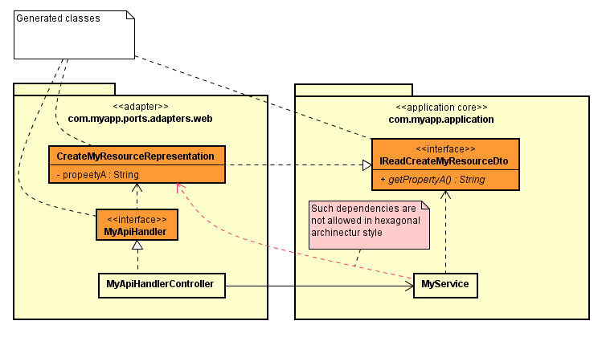

# IRead* interfaces feature
This feature is for [Hexagonal architecture](https://alistair.cockburn.us/hexagonal-architecture/) purists. 
For this architecture style there is an application "core" and some "adapters" to communicate with "core" from outside world.
Adapters can only depend on application core, but not vise-versa. 
For an example "My Market" application supports "list market offers" and "place market offer" operations. 
There is an adapter exposures these operations as REST API resource https://my-market.com/market-offers via HTTP GET and POST methods.

Generated java classes for API models (mainly request/response models) actually belong to adapters.
It is not possible to use such models inside application "core", because adapters can use ports from application "core",
but not vise-versa.

With APICROSS it is possible to generate interface (a-la `IRead*` interface) for API models,
and locate these interfaces inside application "core" packages. Take a look at example:



```java
package com.myapp.ports.adapters.web;

...
@javax.annotation.Generated(value = "io.github.itroadlabs.apicross.springmvc.SpringMvcCodeGenerator")
public class CreateMyResourceRepresentation implements IReadCreateMyResourceDto {
    ...
}
```
```java
package com.myapp.application;
...
@javax.annotation.Generated(value = "io.github.itroadlabs.apicross.springmvc.SpringMvcCodeGenerator")
public interface IReadCreateMyResourceDto {
    String getPropertyA();
    ...
}
```
```java
package com.myapp.ports.adapters.web;
...
@javax.annotation.Generated(value = "io.github.itroadlabs.apicross.springmvc.SpringMvcCodeGenerator")
public interface MyApiHandler {
    @RequestMapping(path = "/my-resource", method = RequestMethod.POST, consumes = "application/json")
    ResponseEntity<?> createMyResource(@RequestBody(required = true) CreateMyResourceRepresentation model,
                             @RequestHeader HttpHeaders headers) throws Exception;
}
```

```java
package com.myapp.ports.adapters.web;
...
@RestController
public class MyApiHandlerController implements MyApyHandler {
    private final MyService myService;
    ...
    @Override
    public ResponseEntity<?> createMyResource(CreateMyResourceRepresentation model, HttpHeaders headers) throws Exception {
        myService.create(model);
        return ResponseEntity.status(204).build();
    }
}
```

```java
package com.myapp.application;
...
@Service
@Validated
public class MyService {
    @Transactional
    public void create(@Valid IReadCreateMyResourceDto dto) {
        MyEntity entity = MyEntity.builder()
            .withPropertyA(dto.getPropertyA())
            ...
            .build();
        ...
    }
}
```

To enable this feature use following configuration:
```xml
    <generatorOptions implementation="io.github.itroadlabs.apicross.springmvc.SpringMvcCodeGeneratorOptions">
        ...
        <apiHandlerPackage>com.myapp.ports.adapters.web</apiHandlerPackage>
        <apiModelPackage>com.myapp.ports.adapters.web</apiModelPackage>
        <enableDataModelReadInterfaces>true</enableDataModelReadInterfaces>
        <apiModelReadInterfacesPackage>com.myapp.application</apiModelReadInterfacesPackage>
        ...
    </generatorOptions>
```